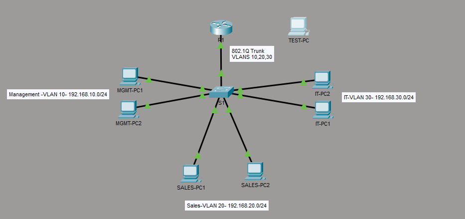

# Multi-Department Business Network

A Cisco Packet Tracer lab connecting Management, Sales, and It departments using VLANs, inter-VLAN routing , DHCP, and access controls.

## Objectives 

- Seperate departments into individual VLANs.
- Allow communication between departments through a router.
- Automatically assign PC network settings using DHCP.
- Restrict SSH administration to the Management subnet.
- Configure and test switch port security.

## Equipment

- 1 Cisco 2911 router: R1
- 1 Cisco 2960 switch: S1
- 6 department PCs
- 1 disconnected TEST-PC for port-security testing
- Cisco Packet Tracer 9.0.0

## Network Topology

R1 Gi0/0 connects to the switchs's Gi0/1 through an 802.1Q trunk carring VLANs 10, 20, and 30.

## VLAN and Addressing Plan

| Department | VLAN | Subnet          | Default Gateway | Switch Ports |
|---|---|---|---|---|
| Management |  10  | 192.168.10.0/24 | 192.168.10.1    |   Fa0/1-2    |
| Sales      |  20  | 192.168.20.0/24 | 192.168.20.1    |   Fa0/3-4    |
| IT         |  30  | 192.168.30.0/24 | 192.168.30.1    |   Fa0/5-6    |

The switch uses 192.168.10.2 on VLAN 10 for management. 

## Configuration Summary 

## Inter-VLAN Routing

R1 uses router-on-a-stick with one subinterfce per VLAN.
Each subinterface provices the default gateway for its subnet. 

### DHCP

R1 provicdes a separate DHCP pool for each department. 
Addresses .1 through .10 are exclueded in each subnet to reserve them for gateways
and infrastructure. 

### SSH Access Control

SSH version 2 and a local administrator account are configured on the router and switch.

The MGMT-ONLY standard ACL permits 192.168.10.0/24 and is applied inbound to ther VTY
lines with access-class. 

This restricts remote administration while preserving normal traffic between departments. 

### Port Security 

Switch ports Fz0/1 through Fa0/6 use:

- A maximum of one secure MAC address per port
- Sticky MAC address learning
- Shutdown mode for security violations

## How to Open

Download Multi-Department-Business-Network.pkt and open in Cisco Packet Tracer 9.0.0.

## Scope

This lab demostrates an internal business network. 
Internet connectivity is not configured. Inter-VLAN traffic is allowed;
the ACL restricts device administration. 